<!--  _class: invert -->
<!-- _color: white -->
<!-- _paginate: skip -->

# CHAPTER 2: Supervised Learning
---

# Classification and Regression

- Classification:
    - class label;

---

# Classification and Regression

- Regression:
    - predict something

---

# Supervised Machine Learning Algorithms

- k-Nearest Neighbors;
- Linear Models;
- Naive Bayes Classifiers;
- Decision Trees;
- Ensembles of Decision Trees;
- Kernelized Support Vector Machines;
- Neural Networks (Deep Learning);

---

# k-Nearest Neighbors Classification

- Building the model consists only of storing the training dataset;
- To make a prediction for a new data point, the algorithm finds the closest data points in the training dataset—its “nearest neighbors”.

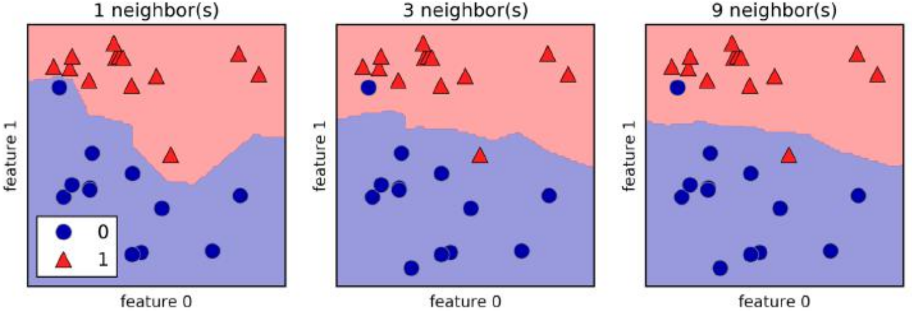

---

# k-Nearest Neighbors Classification Accuracy

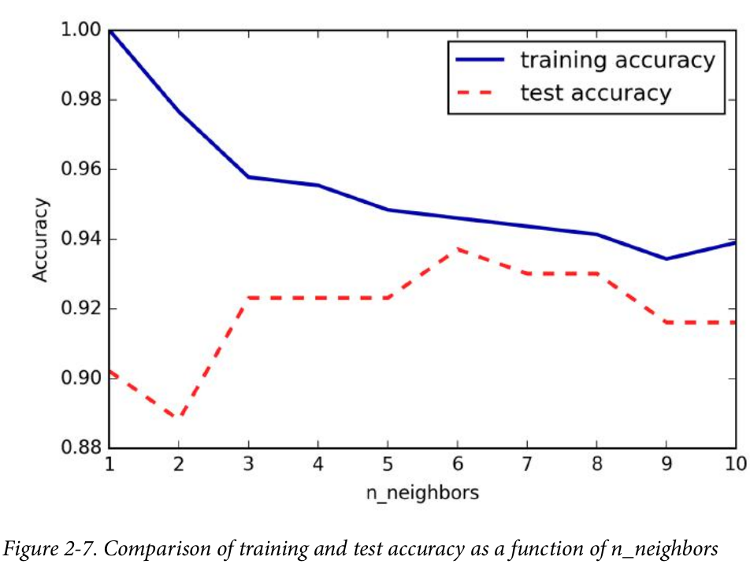

---

# k-Nearest Neighbors Regression

- Again, let’s start by using the single nearest neighbor, this time using the wave dataset;
- The prediction using a single neighbor is just the target value of the nearest neighbor.

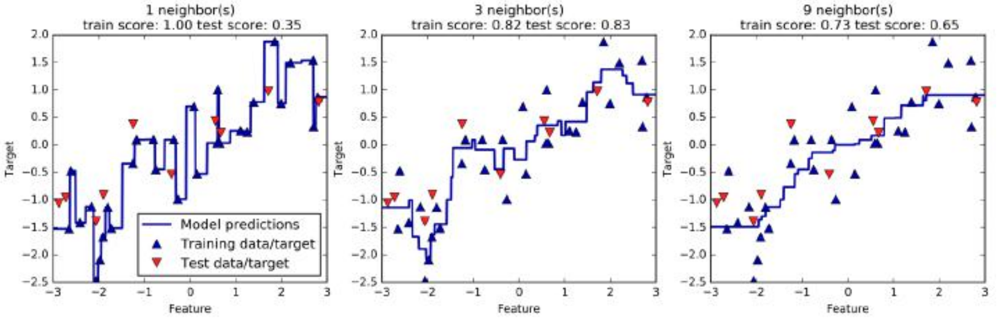

---

# Linear Models Regression

- For regression, the general prediction formula for a linear model looks as follows:

$$
y = w_{0} x_{0} + w_{1} x_{1} + \dots + w_{p} x_{p} + b
$$

in this example, the number of features is p)

---

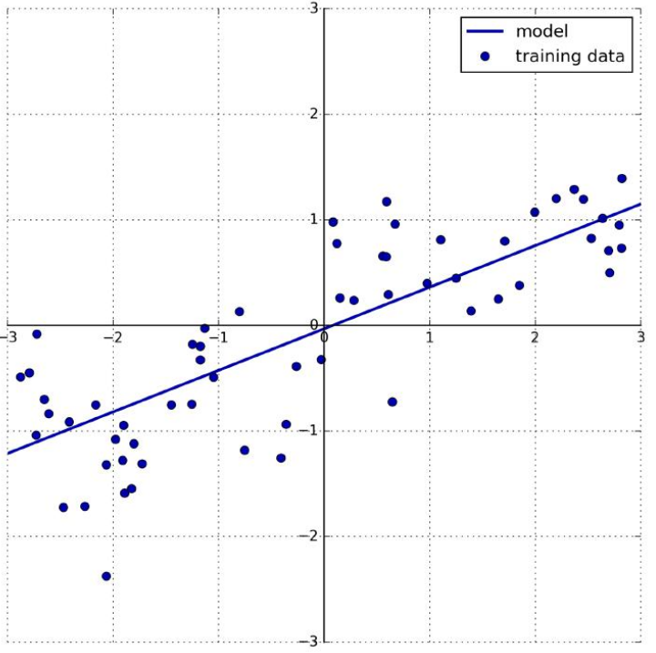

---

# Linear Models - Ridge regression

- The coefficients (w) are chosen not only so that they predict well on the training data, but also to fit an additional constraint;
- We also want the magnitude of coefficients to be as small as possible; in other words, all entries of w should be close to zero;
- The Ridge model makes a trade-off between the simplicity of the model (near-zero coefficients) and its performance on the training set.

---

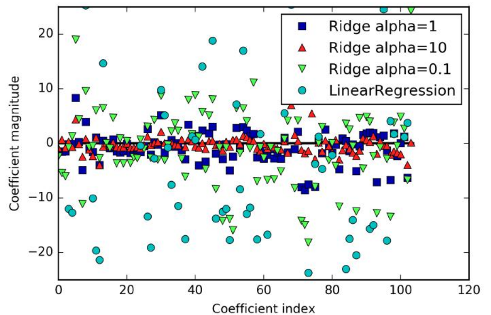

---

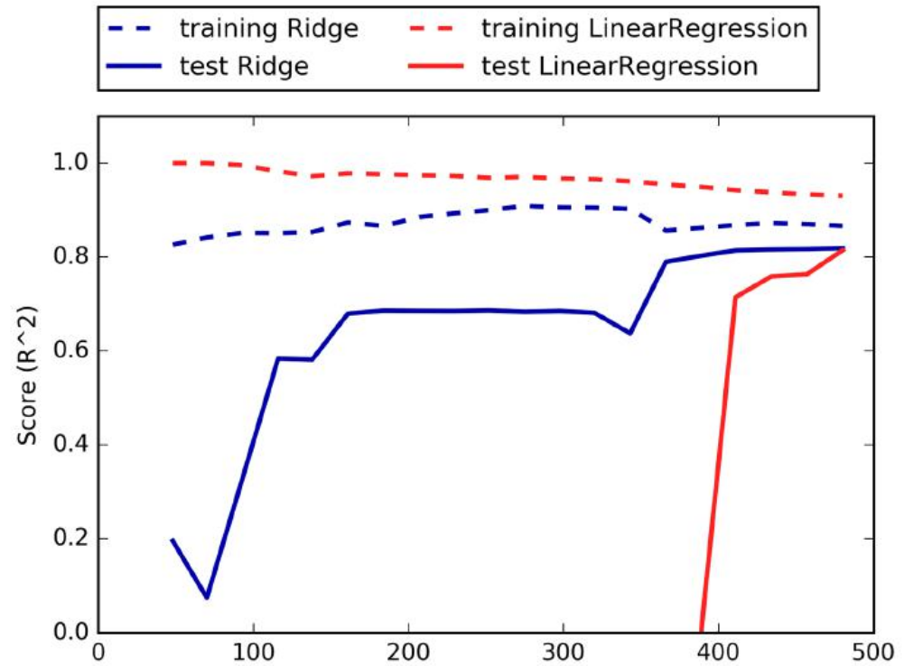

---

# Linear Models - Lasso

- As with ridge regression, using the lasso also restricts coefficients to be close to zero, but in a slightly different way, called L1 regularization;

- The consequence of L1 regularization is that when using the lasso, some coefficients are exactly zero.

---

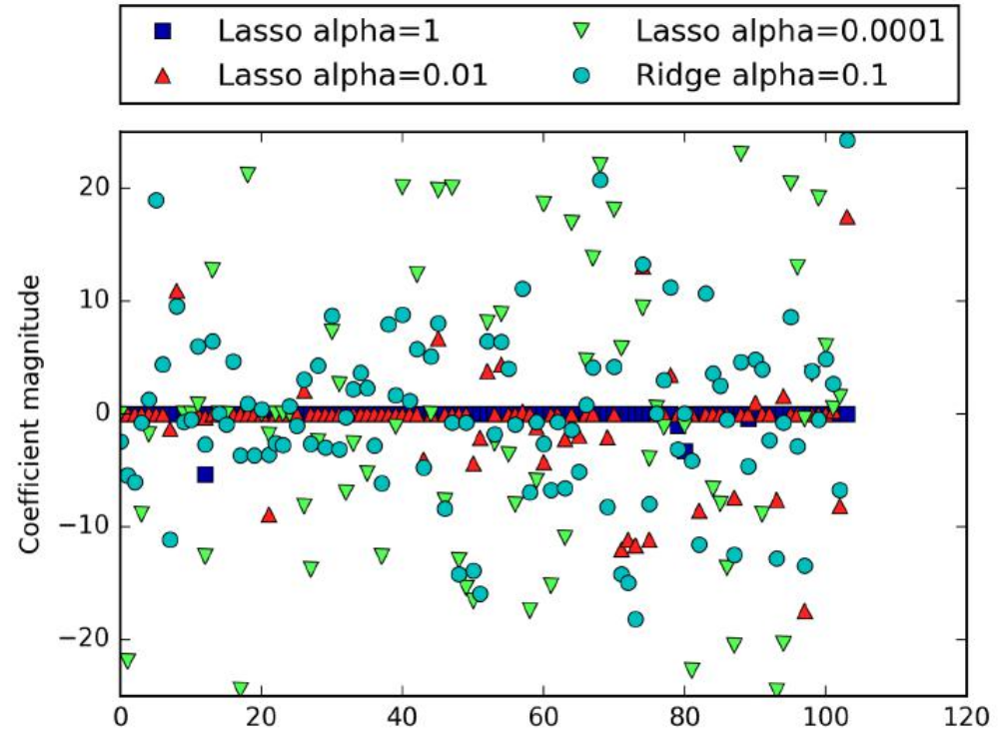

---

# Naive Bayes Classifiers

- Naive Bayes classifiers are a family of classifiers that are quite similar to the linear models discussed in the previous section.

- The price paid for this efficiency is that naive Bayes models often provide generalization performance that is slightly worse than that of linear classifiers like LogisticRegression and LinearSVC.

---

# Decision Trees

Decision trees are widely used models for classification and regression tasks.
 Essentially, they learn a hierarchy of if/else questions, leading to a decision.

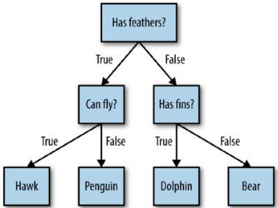

---
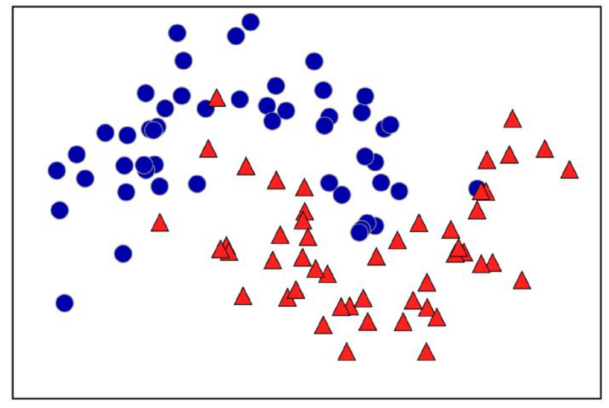

---
# Decision boundary of tree with depth 1
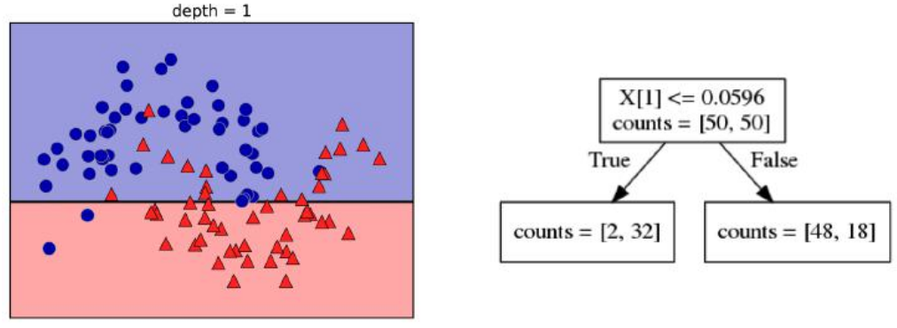

---
# Decision boundary of tree with depth 2

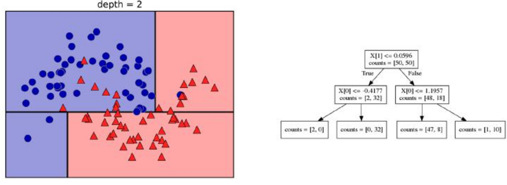

---
# Decision boundary of tree with depth 9
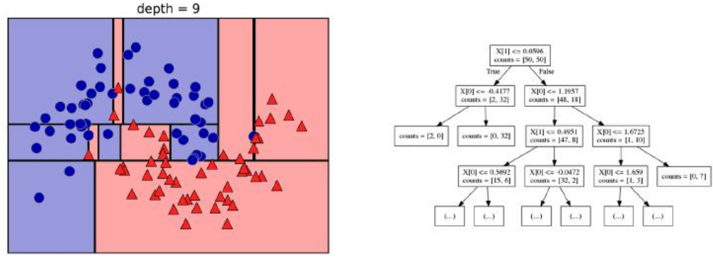

--- 
# Ensembles of Decision Trees

Ensembles are methods that combine multiple machine learning models to create more powerful models:

- Random forests
  - Building random forests.

---

# Random forests

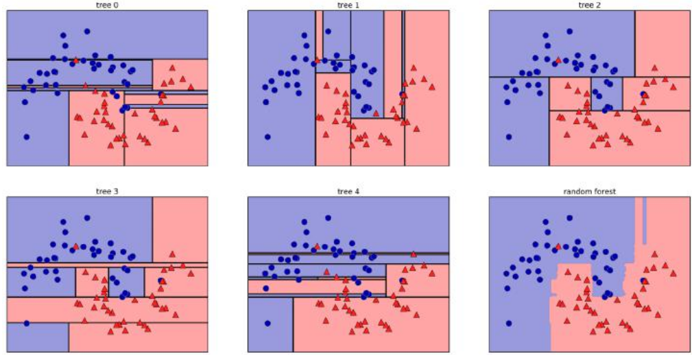

--- 

# Kernelized Support Vector Machines

- Kernelized support vector machines (often just referred to as SVMs) are an extension that allows for more complex models that are not defined simply by hyperplanes in the input space.

--- 

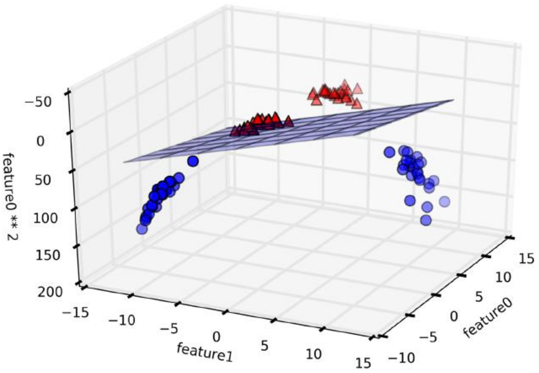

--- 

--- 

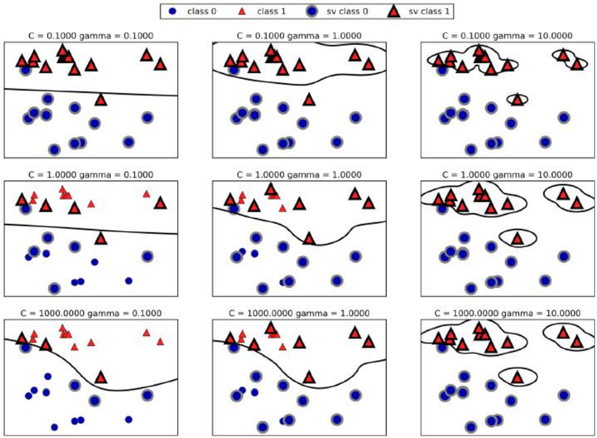

---

# Neural Networks (Deep Learning)

Multilayer perceptrons (MLPs) are also known as (vanilla) feed-forward neural networks, or sometimes just neural networks.

MLPs can be viewed as generalizations of linear models that perform multiple stages of processing to come to a decision.

$$
y = w_{0} x_{0} + w_{1} x_{1} + \dots + w_{p} x_{p} + b
$$

---

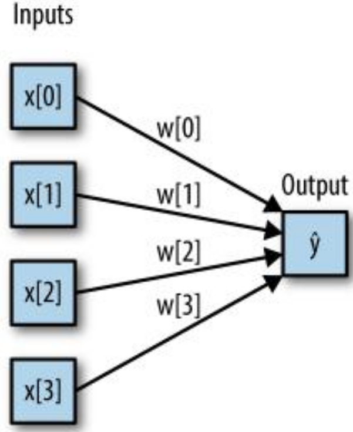

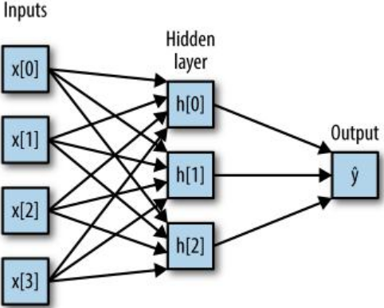

---

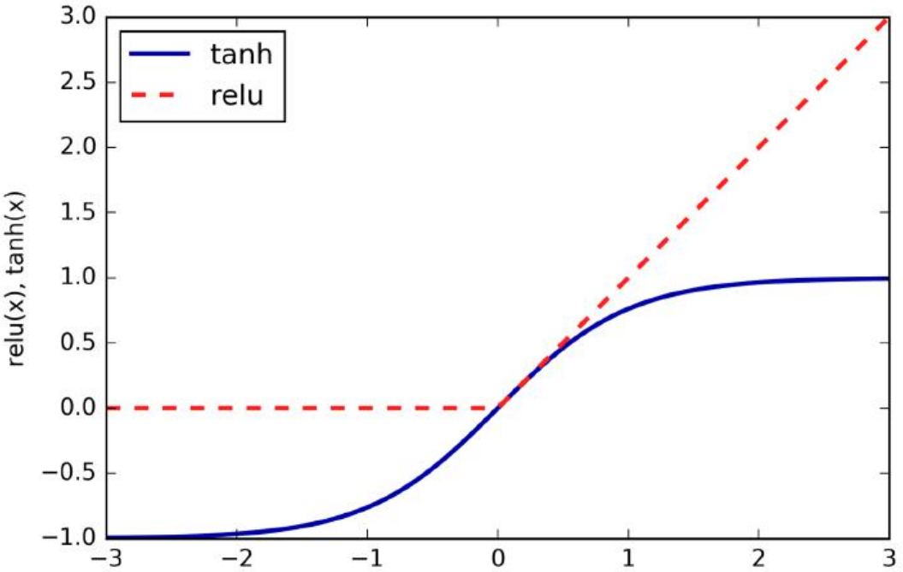

---

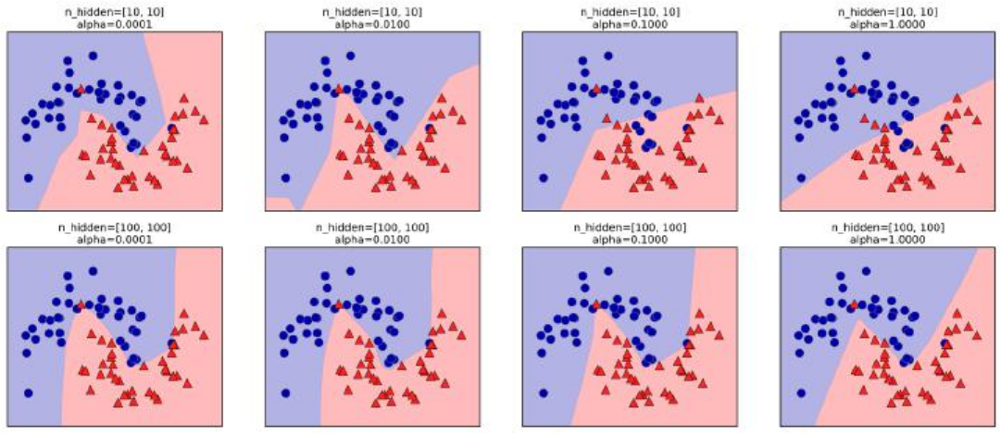