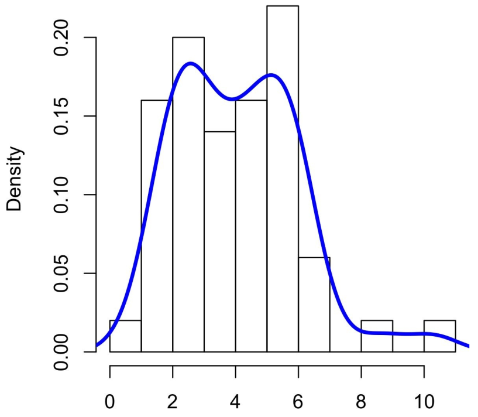
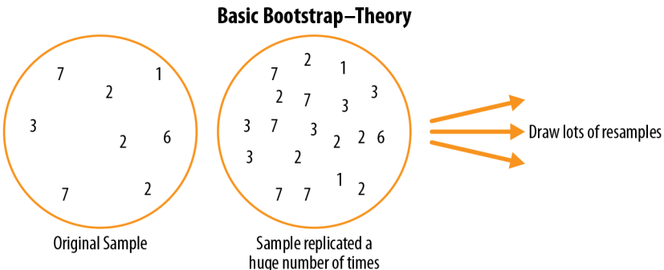

<!--  _class: invert -->
<!-- _color: white -->
<!-- _paginate: skip -->

# Practical Statistics for Data Scientists

---
<!--  _class: invert -->
<!-- _color: white -->

# Chapter 1: Exploratory Data Analysis
---

<!--  _class: invert -->
<!-- _color: white -->

# Type of Mean
---

# Mean

- Mean or average value;

- Sum of all the values divided by the number of values.

$$
\overline X = \frac{\sum_{i}^{n} x_i}{n}
$$

---

# Trimmed mean

- Variation of the mean or trimmed mean;

- Dropping a fixed number (p) of values at each end;

- **Eliminates the influence of extreme value.**

$$
\overline X = \frac{\sum_{i = p + 1}^{n - p} x_i}{n - 2p}
$$

---

# Weighted mean

There are two main motivations for using a weighted mean:
- **Some values are intrinsically more variable than others, and highly variable observations are given a lower weight;**
- **The data collected does not equally represent the different groups that we are interested in measuring.**

$$
\overline X_w = \frac{\sum_{i = 1}^{n} w_i x_i}{\sum_{i}^{n} w_i}
$$

---
<!--  _class: invert -->
<!-- _color: white -->

# Standard Deviation and Related Estimates
---

# Mean absolution deviation

The most widely used estimates of variation are based on the differences, or deviations, between the estimate of location and the observed data.

$$
\frac{\sum^{n}_{i=1} |x_{i} - \overline x|}{n}
$$

---
# Variance

The best-known estimates for variability are the variance and the standard deviation, which are based on squared deviations.

$$
s^{2} = \frac{\sum^{n}_{i=1} (x_{i} - \overline x) ^{2}}{n - 1}
$$

---

# Standard deviation

The standard deviation is much easier to interpret than the variance since it is on the same scale as the original data.

$$
\sqrt{s^{2}} = s
$$

---
# PERCENTILE: PRECISE DEFINITION

Formally, the percentile is the weighted average:
$$
P = (1 - w) x_{j} + w x_{j + 1}
$$
for some weight w between 0 and 1. Statistical software has slightly differing approaches to choosing w. Except for small data sets, you don’t usually need to worry about the precise way a percentile is calculated.

---
<!--  _class: invert -->
<!-- _color: white -->

# Exploring the Data Distribution
---
# Boxplots

- The top and bottom of the box are the 75th and 25th percentiles, respectively;
- The median is shown by the horizontal line in the box;
- The dashed lines, referred to as whiskers, extend from the top and bottom to indicate the range for the bulk of the data;

---
 # Density Estimates

- Related to the histogram is a density plot, which shows the distribution of data values as a continuous line;

---
<!--  _class: invert -->
<!-- _color: white -->

 # CHAPTER 2: Data and Sampling Distributions

---

# Bias

- Statistical bias refers to measurement or sampling errors that are systematic and produced by the measurement or sampling process;

- When a result does suggest bias (e.g., by reference to a benchmark or actual values), it is often an indicator that a statistical or machine learning model has been misspecified, or an important variable left out.

--- 

# Sampling Distribution of a Statistic

Standard Error:

- The standard error is a single metric that sums up the variability in the sampling distribution for a statistic.
- The standard error can be estimated using a statistic based on the standard deviation s of the sample values, and the sample size n:

$$
SE = \frac{s}{\sqrt{n}}
$$

---

# The Bootstrap

One easy and effective way to estimate the sampling distribution of a statistic, or of model parameters, is to draw additional samples, with replacement, from the sample itself and recalculate the statistic or model for each resample.

<!-- 

     

 -->

---

